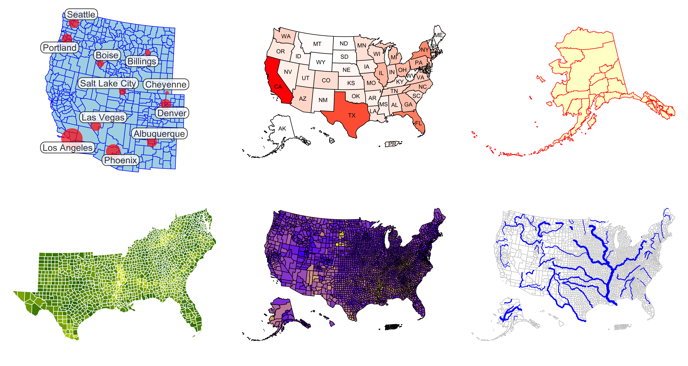
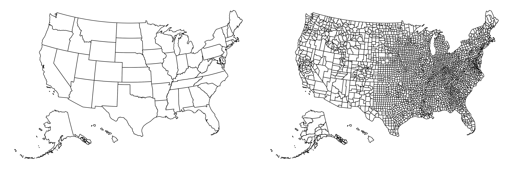
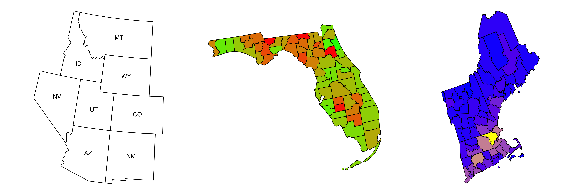
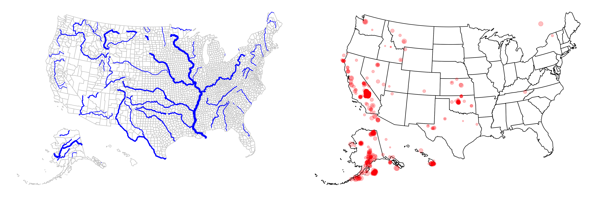

<!-- README.md is generated from README.Rmd. Please edit that file -->

# 🗺 usmap

<!-- badges: start -->

[](https://cran.r-project.org/package=usmap)
[](https://cran.r-project.org/package=usmap)
[](https://actions-badge.atrox.dev/pdil/usmap/goto?ref=master)
[](https://app.codecov.io/gh/pdil/usmap)
<!-- badges: end -->



## Purpose

Typically in R it is difficult to create nice US
[choropleths](https://en.wikipedia.org/wiki/Choropleth_map) that include
Alaska and Hawaii. The functions presented here attempt to elegantly
solve this problem by manually moving these states to a new location and
providing a simple features ([`sf`](https://github.com/r-spatial/sf))
object for mapping and visualization. This allows the user to easily add
spatial data or features to the US map.

## Shape Files

The shape files that we use to plot the maps in R are located in the
[`usmapdata`](https://github.com/pdil/usmapdata) package. These are
generated from the [US Census Bureau cartographic boundary
files](https://www.census.gov/geographies/mapping-files/time-series/geo/cartographic-boundary.html).
Maps at both the state and county levels are included for convenience.

#### Update History

| Date              | `usmap` version | Shape File Year |                                                  Link                                                  |
|-------------------|:---------------:|:---------------:|:------------------------------------------------------------------------------------------------------:|
| (unreleased)      |      0.7.0      |      2022       | [🔗](https://www.census.gov/geographies/mapping-files/time-series/geo/cartographic-boundary.2022.html) |
| February 27, 2022 |      0.6.0      |      2020       | [🔗](https://www.census.gov/geographies/mapping-files/time-series/geo/cartographic-boundary.2020.html) |
| June 3, 2018      |      0.3.0      |      2017       |  [🔗](https://www.census.gov/geographies/mapping-files/time-series/geo/carto-boundary-file.2017.html)  |
| January 29, 2017  |      0.1.0      |      2015       |  [🔗](https://www.census.gov/geographies/mapping-files/time-series/geo/carto-boundary-file.2015.html)  |

## Installation

📦 To install from CRAN (recommended), run the following code in an R
console:

``` r
install.packages("usmap")
```

### Developer Build

⚠️ The developer build may be unstable and not function correctly, use
with caution.

To install the package from this repository, run the following code in
an R console:

``` r
install.package("devtools")
devtools::install_github("pdil/usmap")
```

This method will provide the most recent developer build of `usmap`.

To begin using `usmap`, import the package using the `library` command:

``` r
library(usmap)
```

## Documentation

To read the package vignettes, which explain helpful uses of the
package, use `vignette`:

``` r
vignette(package = "usmap")
vignette("usmap1", package = "usmap") # 1. Introduction
vignette("usmap2", package = "usmap") # 2. Mapping the US
vignette("usmap3", package = "usmap") # 3. Advanced Mapping
```

For further help with this package, open an
[issue](https://github.com/pdil/usmap/issues) or ask a question on Stack
Overflow with the [usmap
tag](https://stackoverflow.com/questions/tagged/usmap).

## Features

### Map Plots

- Plot US maps

``` r
states <- plot_usmap("states")
counties <- plot_usmap("counties")

cowplot::plot_grid(states, counties, nrow = 1)
```



- Display only certain states, counties, or regions

``` r
library(ggplot2)

mt <- plot_usmap("states", include = .mountain, labels = TRUE)

fl <- plot_usmap("counties", data = countypov, values = "pct_pov_2014", include = "FL") +
  scale_fill_continuous(low = "green", high = "red", guide = "none")

ne <- plot_usmap("counties", data = countypop, values = "pop_2015", include = .new_england) +
  scale_fill_continuous(low = "blue", high = "yellow", guide = "none")

cowplot::plot_grid(mt, fl, ne, nrow = 1)
```



- Transform and add spatial data to map

``` r
library(ggplot2)

# Transform included `usrivers` data set
rivers_transformed <- usmap_transform(usrivers)

river_map <- plot_usmap("counties", color = "gray80") +
  geom_sf(data = rivers_transformed, aes(linewidth = Shape_Length), color = "blue") +
  scale_linewidth_continuous(range = c(0.3, 1.5), guide = "none")

# Transform included `earthquakes` data set
eq_transformed <- usmap_transform(earthquakes)

earthquake_map <- plot_usmap() +
  geom_sf(data = eq_transformed, aes(size = mag), color = "red", alpha = 0.25) +
  scale_size_continuous(guide = "none")

cowplot::plot_grid(river_map, earthquake_map, nrow = 1)
```



### Map Data

- Obtain map data with certain region breakdown

``` r
us_map(regions = "states")
#> Simple feature collection with 51 features and 3 fields
#> Geometry type: MULTIPOLYGON
#> Dimension:     XY
#> Bounding box:  xmin: -2590847 ymin: -2608151 xmax: 2523583 ymax: 731405.7
#> Projected CRS: NAD27 / US National Atlas Equal Area
#> # A tibble: 51 × 4
#>    fips  abbr  full                                                         geom
#>    <chr> <chr> <chr>                                          <MULTIPOLYGON [m]>
#>  1 02    AK    Alaska               (((-2396840 -2547726, -2393291 -2546396, -2…
#>  2 01    AL    Alabama              (((1093779 -1378539, 1093270 -1374227, 1092…
#>  3 05    AR    Arkansas             (((483066 -927786.9, 506063 -926262.2, 5315…
#>  4 04    AZ    Arizona              (((-1388677 -1254586, -1389182 -1251858, -1…
#>  5 06    CA    California           (((-1719948 -1090032, -1709613 -1090025, -1…
#>  6 08    CO    Colorado             (((-789537.1 -678772.6, -789536.6 -678768.3…
#>  7 09    CT    Connecticut          (((2161728 -83727.16, 2177177 -65210.71, 21…
#>  8 11    DC    District of Columbia (((1955475 -402047.2, 1960230 -393564, 1964…
#>  9 10    DE    Delaware             (((2042501 -284358, 2043073 -279990.9, 2044…
#> 10 12    FL    Florida              (((1855614 -2064805, 1860160 -2054368, 1867…
#> # ℹ 41 more rows
```

``` r
us_map(regions = "counties")
#> Simple feature collection with 3144 features and 4 fields
#> Geometry type: MULTIPOLYGON
#> Dimension:     XY
#> Bounding box:  xmin: -2590847 ymin: -2608151 xmax: 2523583 ymax: 731405.7
#> Projected CRS: NAD27 / US National Atlas Equal Area
#> # A tibble: 3,144 × 5
#>    fips  abbr  full   county                                                geom
#>    <chr> <chr> <chr>  <chr>                                   <MULTIPOLYGON [m]>
#>  1 02013 AK    Alaska Aleutians East Borough       (((-1762717 -2477334, -17612…
#>  2 02016 AK    Alaska Aleutians West Census Area   (((-2396840 -2547726, -23932…
#>  3 02020 AK    Alaska Anchorage Municipality       (((-1517576 -2089907, -15176…
#>  4 02050 AK    Alaska Bethel Census Area           (((-1905137 -2137044, -19008…
#>  5 02060 AK    Alaska Bristol Bay Borough          (((-1685824 -2253496, -16840…
#>  6 02063 AK    Alaska Chugach Census Area          (((-1476668 -2101298, -14698…
#>  7 02066 AK    Alaska Copper River Census Area     (((-1457012 -2063407, -14434…
#>  8 02068 AK    Alaska Denali Borough               (((-1585790 -1980739, -15864…
#>  9 02070 AK    Alaska Dillingham Census Area       (((-1793023 -2236834, -17884…
#> 10 02090 AK    Alaska Fairbanks North Star Borough (((-1512362 -1851013, -14878…
#> # ℹ 3,134 more rows
```

### FIPS Codes

- Look up FIPS codes for states and counties

``` r
fips("New Jersey")
#> [1] "34"

fips(c("AZ", "CA", "New Hampshire"))
#> [1] "04" "06" "33"

fips("NJ", county = "Mercer")
#> [1] "34021"

fips("NJ", county = c("Bergen", "Hudson", "Mercer"))
#> [1] "34003" "34017" "34021"
```

- Retrieve states or counties with FIPS codes

``` r
fips_info(c("34", "35"))
#>   abbr fips       full
#> 1   NJ   34 New Jersey
#> 2   NM   35 New Mexico

fips_info(c("34021", "35021"))
#>         full abbr         county  fips
#> 1 New Jersey   NJ  Mercer County 34021
#> 2 New Mexico   NM Harding County 35021
```

- Add FIPS codes to data frame

``` r
library(dplyr)

data <- data.frame(
  state = c("NJ", "NJ", "NJ", "PA"),
  county = c("Bergen", "Hudson", "Mercer", "Allegheny")
)

data %>% rowwise %>% mutate(fips = fips(state, county))
#> # A tibble: 4 × 3
#> # Rowwise: 
#>   state county    fips 
#>   <chr> <chr>     <chr>
#> 1 NJ    Bergen    34003
#> 2 NJ    Hudson    34017
#> 3 NJ    Mercer    34021
#> 4 PA    Allegheny 42003
```

## Additional Information

### Coordinate System

`usmap` uses the [US National Atlas Equal Area](https://epsg.io/9311)
coordinate system:

<details>
<summary>
<code>sf::st_crs(9311)</code>
</summary>

      #> Coordinate Reference System:
      #>   User input: EPSG:9311 
      #>   wkt:
      #> PROJCRS["NAD27 / US National Atlas Equal Area",
      #>     BASEGEOGCRS["NAD27",
      #>         DATUM["North American Datum 1927",
      #>             ELLIPSOID["Clarke 1866",6378206.4,294.978698213898,
      #>                 LENGTHUNIT["metre",1]]],
      #>         PRIMEM["Greenwich",0,
      #>             ANGLEUNIT["degree",0.0174532925199433]],
      #>         ID["EPSG",4267]],
      #>     CONVERSION["US National Atlas Equal Area",
      #>         METHOD["Lambert Azimuthal Equal Area (Spherical)",
      #>             ID["EPSG",1027]],
      #>         PARAMETER["Latitude of natural origin",45,
      #>             ANGLEUNIT["degree",0.0174532925199433],
      #>             ID["EPSG",8801]],
      #>         PARAMETER["Longitude of natural origin",-100,
      #>             ANGLEUNIT["degree",0.0174532925199433],
      #>             ID["EPSG",8802]],
      #>         PARAMETER["False easting",0,
      #>             LENGTHUNIT["metre",1],
      #>             ID["EPSG",8806]],
      #>         PARAMETER["False northing",0,
      #>             LENGTHUNIT["metre",1],
      #>             ID["EPSG",8807]]],
      #>     CS[Cartesian,2],
      #>         AXIS["easting (X)",east,
      #>             ORDER[1],
      #>             LENGTHUNIT["metre",1]],
      #>         AXIS["northing (Y)",north,
      #>             ORDER[2],
      #>             LENGTHUNIT["metre",1]],
      #>     USAGE[
      #>         SCOPE["Statistical analysis."],
      #>         AREA["United States (USA) - onshore and offshore."],
      #>         BBOX[15.56,167.65,74.71,-65.69]],
      #>     ID["EPSG",9311]]

</details>

This [coordinate reference system
(CRS)](https://www.nceas.ucsb.edu/sites/default/files/2020-04/OverviewCoordinateReferenceSystems.pdf)
can also be obtained with `usmap::usmap_crs()`.

## Acknowledgments

The code used to generate the map files was based on this blog post by
[Bob Rudis](https://github.com/hrbrmstr): [Moving The Earth (well,
Alaska & Hawaii) With
R](https://rud.is/b/2014/11/16/moving-the-earth-well-alaska-hawaii-with-r/)
