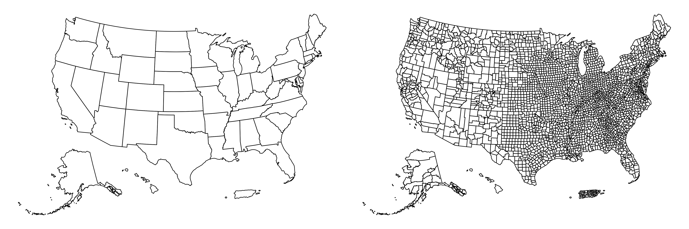
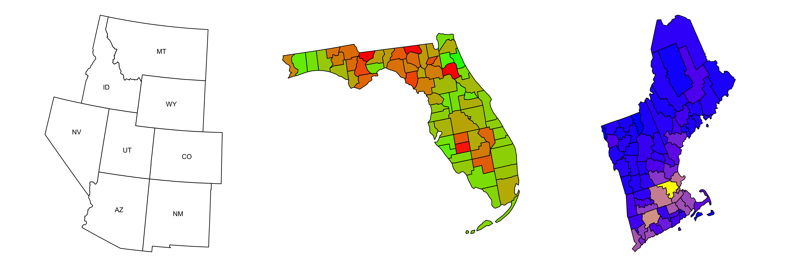
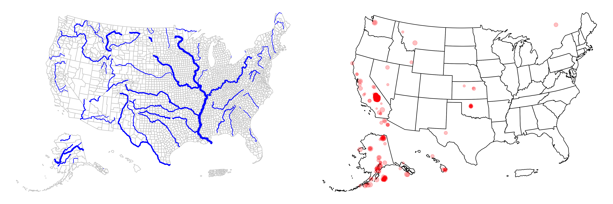

<!-- README.md is generated from README.Rmd. Please edit that file -->

# 🗺 usmap

<!-- badges: start -->

[](https://cran.r-project.org/package=usmap)
[](https://cran.r-project.org/package=usmap)
[](https://github.com/pdil/usmap/actions/workflows/check.yaml)
[](https://app.codecov.io/gh/pdil/usmap)
<!-- badges: end -->


## Purpose

Typically in R it is difficult to create nice US
[choropleths](https://en.wikipedia.org/wiki/Choropleth_map) that include
Alaska and Hawaii. The functions presented here attempt to elegantly
solve this problem by manually moving these states to a new location and
providing a simple features ([`sf`](https://github.com/r-spatial/sf))
object for mapping and visualization. This allows the user to easily add
spatial data or features to the US map.

## Available Map Data

The map data files that we use to plot the maps in R are located in the
[`usmapdata`](https://github.com/pdil/usmapdata) package. These are
generated from the [US Census Bureau cartographic boundary
files](https://www.census.gov/geographies/mapping-files/time-series/geo/cartographic-boundary.html).
Maps at both the state and county levels are included for convenience.

In `usmap v0.8.0` the `data_year` parameter was added to most package
functions, allowing the user to select from multiple available years.
Since data is now stored in `usmapdata`, updates are no longer tied to
`usmap` versions.

#### Update History

| Date | Available Years |
|----|:--:|
| ??? | [2021](https://www.census.gov/geographies/mapping-files/time-series/geo/cartographic-boundary.2021.html), [2022](https://www.census.gov/geographies/mapping-files/time-series/geo/cartographic-boundary.2022.html), [2023](https://www.census.gov/geographies/mapping-files/time-series/geo/cartographic-boundary.2023.html), [2024](https://www.census.gov/geographies/mapping-files/time-series/geo/cartographic-boundary.2024.html) |

Prior to `usmap v0.8.0`:

| Date | `usmap` version | Available Year |
|----|:--:|:--:|
| May 10, 2024 | 0.7.1 | [2023](https://www.census.gov/geographies/mapping-files/time-series/geo/cartographic-boundary.2023.html) |
| January 20, 2024 | 0.7.0 | [2022](https://www.census.gov/geographies/mapping-files/time-series/geo/cartographic-boundary.2022.html) |
| February 27, 2022 | 0.6.0 | [2020](https://www.census.gov/geographies/mapping-files/time-series/geo/cartographic-boundary.2020.html) |
| June 3, 2018 | 0.3.0 | [2017](https://www.census.gov/geographies/mapping-files/time-series/geo/carto-boundary-file.2017.html) |
| January 29, 2017 | 0.1.0 | [2015](https://www.census.gov/geographies/mapping-files/time-series/geo/carto-boundary-file.2015.html) |

## Installation

📦 To install from CRAN (recommended), run the following code in an R
console:

``` r
install.packages("usmap")
```

### Developer Build

⚠️ The developer build may be unstable and not function correctly, use
with caution.

To install the package from this repository, run the following code in
an R console:

``` r
install.package("devtools")
devtools::install_github("pdil/usmap")
```

This method will provide the most recent developer build of `usmap`.

To begin using `usmap`, import the package using the `library` command:

``` r
library(usmap)
```

## Documentation

To read the package vignettes, which explain helpful uses of the
package, use `vignette`:

``` r
vignette(package = "usmap")
vignette("usmap1", package = "usmap") # 1. Introduction
vignette("usmap2", package = "usmap") # 2. Mapping the US
vignette("usmap3", package = "usmap") # 3. Advanced Mapping
```

For further help with this package, open an
[issue](https://github.com/pdil/usmap/issues) or ask a question on Stack
Overflow with the [usmap
tag](https://stackoverflow.com/questions/tagged/usmap).

## Features

### Map Plots

- Plot US maps

``` r
states <- plot_usmap("states")
counties <- plot_usmap("counties")

cowplot::plot_grid(states, counties, nrow = 1)
```



- Display only certain states, counties, or regions

``` r
library(ggplot2)

mt <- plot_usmap("states", include = .mountain, labels = TRUE)

fl <- plot_usmap("counties", data = countypov, values = "pct_pov_2021", include = "FL") +
  scale_fill_continuous(low = "green", high = "red", guide = "none")

ne <- plot_usmap("counties", data = countypop, values = "pop_2022", include = .new_england) +
  scale_fill_continuous(low = "blue", high = "yellow", guide = "none")

cowplot::plot_grid(mt, fl, ne, nrow = 1)
```



- Transform and add spatial data to map

``` r
library(ggplot2)

# Transform included `usrivers` data set
rivers_transformed <- usmap_transform(usrivers)

river_map <- plot_usmap("counties", color = "gray80") +
  geom_sf(data = rivers_transformed, aes(linewidth = Shape_Length), color = "blue") +
  scale_linewidth_continuous(range = c(0.3, 1.5), guide = "none")

# Transform included `earthquakes` data set
eq_transformed <- usmap_transform(earthquakes)

earthquake_map <- plot_usmap() +
  geom_sf(data = eq_transformed, aes(size = mag), color = "red", alpha = 0.25) +
  scale_size_continuous(guide = "none")

cowplot::plot_grid(river_map, earthquake_map, nrow = 1)
```



### Map Data

- Obtain map data with certain region breakdown

``` r
us_map(regions = "states")
#> Simple feature collection with 51 features and 3 fields
#> Geometry type: MULTIPOLYGON
#> Dimension:     XY
#> Bounding box:  xmin: -2584074 ymin: -2602555 xmax: 2516258 ymax: 731628.1
#> Projected CRS: NAD27 / US National Atlas Equal Area
#> # A tibble: 51 × 4
#>    fips  abbr  full                                                         geom
#>    <chr> <chr> <chr>                                          <MULTIPOLYGON [m]>
#>  1 02    AK    Alaska               (((-2390688 -2541831, -2387144 -2540510, -2…
#>  2 01    AL    Alabama              (((1091785 -1380715, 1091274 -1376393, 1090…
#>  3 05    AR    Arkansas             (((482022.2 -928936.8, 504969.3 -927409.9, …
#>  4 04    AZ    Arizona              (((-1386064 -1256492, -1386565 -1253758, -1…
#>  5 06    CA    California           (((-1716581 -1091606, -1706264 -1091597, -1…
#>  6 08    CO    Colorado             (((-787705.6 -679505.6, -787705.1 -679501.3…
#>  7 09    CT    Connecticut          (((2156162 -83795.62, 2171549 -65263.26, 21…
#>  8 11    DC    District of Columbia (((1950799 -402452.2, 1955532 -393958.4, 19…
#>  9 10    DE    Delaware             (((2037480 -284625.1, 2038045 -280253.1, 20…
#> 10 12    FL    Florida              (((1853163 -2069104, 1857692 -2058634, 1864…
#> # ℹ 41 more rows
```

``` r
us_map(regions = "counties")
#> Simple feature collection with 3144 features and 4 fields
#> Geometry type: MULTIPOLYGON
#> Dimension:     XY
#> Bounding box:  xmin: -2584074 ymin: -2602555 xmax: 2516258 ymax: 731628.1
#> Projected CRS: NAD27 / US National Atlas Equal Area
#> # A tibble: 3,144 × 5
#>    fips  abbr  full   county                                                geom
#>    <chr> <chr> <chr>  <chr>                                   <MULTIPOLYGON [m]>
#>  1 02013 AK    Alaska Aleutians East Borough       (((-1757988 -2472695, -17565…
#>  2 02016 AK    Alaska Aleutians West Census Area   (((-2390688 -2541831, -23871…
#>  3 02020 AK    Alaska Anchorage Municipality       (((-1513326 -2086615, -15133…
#>  4 02050 AK    Alaska Bethel Census Area           (((-1899724 -2132957, -18954…
#>  5 02060 AK    Alaska Bristol Bay Borough          (((-1681144 -2249485, -16793…
#>  6 02063 AK    Alaska Chugach Census Area          (((-1472549 -2098045, -14657…
#>  7 02066 AK    Alaska Copper River Census Area     (((-1452955 -2060293, -14394…
#>  8 02068 AK    Alaska Denali Borough               (((-1581283 -1977646, -15819…
#>  9 02070 AK    Alaska Dillingham Census Area       (((-1788018 -2232676, -17835…
#> 10 02090 AK    Alaska Fairbanks North Star Borough (((-1508063 -1848448, -14836…
#> # ℹ 3,134 more rows
```

### FIPS Codes

- Look up FIPS codes for states and counties

``` r
fips("New Jersey")
#> [1] "34"

fips(c("AZ", "CA", "New Hampshire"))
#> [1] "04" "06" "33"

fips("NJ", county = "Mercer")
#> [1] "34021"

fips("NJ", county = c("Bergen", "Hudson", "Mercer"))
#> [1] "34003" "34017" "34021"
```

- Retrieve states or counties with FIPS codes

``` r
fips_info(c("34", "35"))
#>   abbr fips       full
#> 1   NJ   34 New Jersey
#> 2   NM   35 New Mexico

fips_info(c("34021", "35021"))
#>         full abbr         county  fips
#> 1 New Jersey   NJ  Mercer County 34021
#> 2 New Mexico   NM Harding County 35021
```

- Add FIPS codes to data frame

``` r
library(dplyr)

data <- data.frame(
  state = c("NJ", "NJ", "NJ", "PA"),
  county = c("Bergen", "Hudson", "Mercer", "Allegheny")
)

data %>% rowwise %>% mutate(fips = fips(state, county))
#> # A tibble: 4 × 3
#> # Rowwise: 
#>   state county    fips 
#>   <chr> <chr>     <chr>
#> 1 NJ    Bergen    34003
#> 2 NJ    Hudson    34017
#> 3 NJ    Mercer    34021
#> 4 PA    Allegheny 42003
```

## Additional Information

### Citation Information

The images generated by `usmap` are not under any copyright restrictions
and may be used and distributed freely in any publication or otherwise.

The underlying shapefiles used to generate the map data are derived from
the [US Census Bureau’s TIGER/Line
Shapefiles](https://www.census.gov/geographies/mapping-files/time-series/geo/tiger-line-file.2023.html#list-tab-790442341)
which are not copyrighted but do suggest citation. See [section 1.2 of
this
document](https://www2.census.gov/geo/pdfs/maps-data/data/tiger/tgrshp2023/TGRSHP2023_TechDoc_Ch1.pdf).

If you wish to cite `usmap` in a publication (appreciated but never
required!), you may do so in the following way:

``` r
citation("usmap")
#> To cite package 'usmap' in publications use:
#> 
#>   Di Lorenzo P (2024). _usmap: US Maps Including Alaska and Hawaii_.
#>   doi:10.32614/CRAN.package.usmap
#>   <https://doi.org/10.32614/CRAN.package.usmap>, R package version
#>   0.7.1, <https://CRAN.R-project.org/package=usmap>.
#> 
#> A BibTeX entry for LaTeX users is
#> 
#>   @Manual{,
#>     title = {usmap: US Maps Including Alaska and Hawaii},
#>     author = {Paolo {Di Lorenzo}},
#>     year = {2024},
#>     note = {R package version 0.7.1},
#>     url = {https://CRAN.R-project.org/package=usmap},
#>     doi = {10.32614/CRAN.package.usmap},
#>   }
```

### Coordinate System

`usmap` uses the [US National Atlas Equal Area](https://epsg.io/9311)
coordinate system:

<details>

<summary>

<code>sf::st_crs(9311)</code>
</summary>

      #> Coordinate Reference System:
      #>   User input: EPSG:9311 
      #>   wkt:
      #> PROJCRS["NAD27 / US National Atlas Equal Area",
      #>     BASEGEOGCRS["NAD27",
      #>         DATUM["North American Datum 1927",
      #>             ELLIPSOID["Clarke 1866",6378206.4,294.978698213898,
      #>                 LENGTHUNIT["metre",1]]],
      #>         PRIMEM["Greenwich",0,
      #>             ANGLEUNIT["degree",0.0174532925199433]],
      #>         ID["EPSG",4267]],
      #>     CONVERSION["US National Atlas Equal Area",
      #>         METHOD["Lambert Azimuthal Equal Area (Spherical)",
      #>             ID["EPSG",1027]],
      #>         PARAMETER["Latitude of natural origin",45,
      #>             ANGLEUNIT["degree",0.0174532925199433],
      #>             ID["EPSG",8801]],
      #>         PARAMETER["Longitude of natural origin",-100,
      #>             ANGLEUNIT["degree",0.0174532925199433],
      #>             ID["EPSG",8802]],
      #>         PARAMETER["False easting",0,
      #>             LENGTHUNIT["metre",1],
      #>             ID["EPSG",8806]],
      #>         PARAMETER["False northing",0,
      #>             LENGTHUNIT["metre",1],
      #>             ID["EPSG",8807]]],
      #>     CS[Cartesian,2],
      #>         AXIS["easting (X)",east,
      #>             ORDER[1],
      #>             LENGTHUNIT["metre",1]],
      #>         AXIS["northing (Y)",north,
      #>             ORDER[2],
      #>             LENGTHUNIT["metre",1]],
      #>     USAGE[
      #>         SCOPE["Statistical analysis."],
      #>         AREA["United States (USA) - onshore and offshore."],
      #>         BBOX[15.56,167.65,74.71,-65.69]],
      #>     ID["EPSG",9311]]

</details>

This [coordinate reference system
(CRS)](https://www.nceas.ucsb.edu/sites/default/files/2020-04/OverviewCoordinateReferenceSystems.pdf)
can also be obtained with `usmap::usmap_crs()`.

## Acknowledgments

The code used to generate the map files was based on this blog post by
[Bob Rudis](https://github.com/hrbrmstr): [Moving The Earth (well,
Alaska & Hawaii) With
R](https://rud.is/b/2014/11/16/moving-the-earth-well-alaska-hawaii-with-r/).
